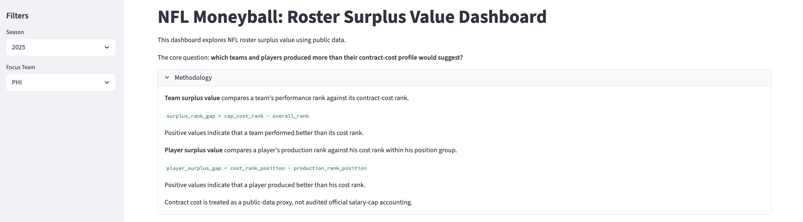
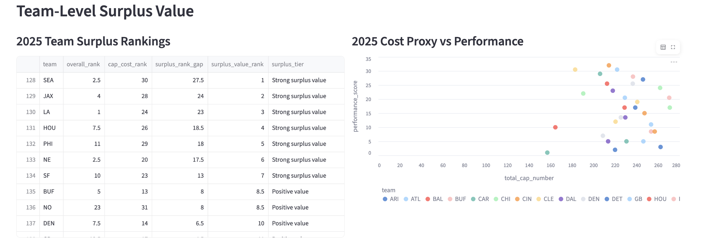
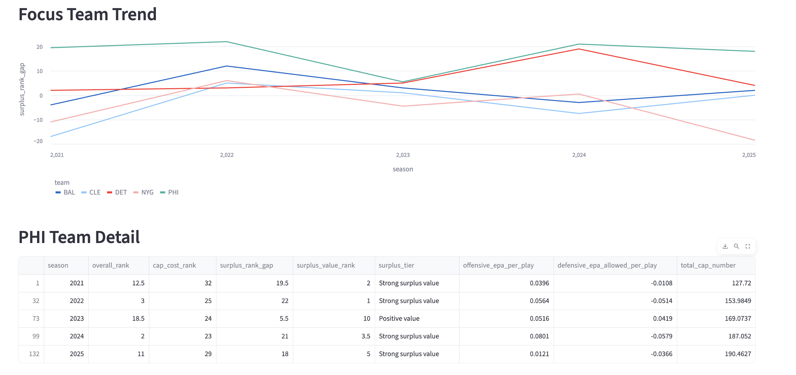
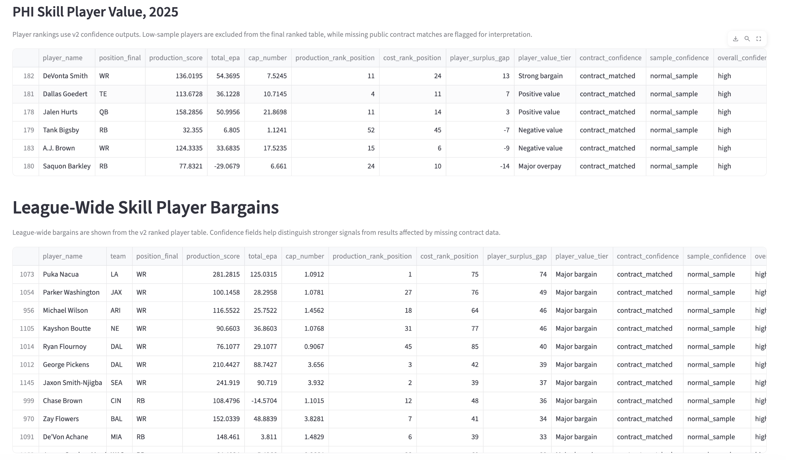
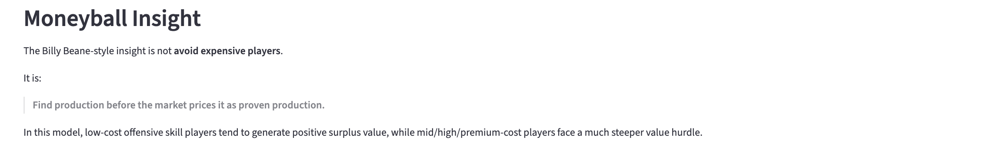
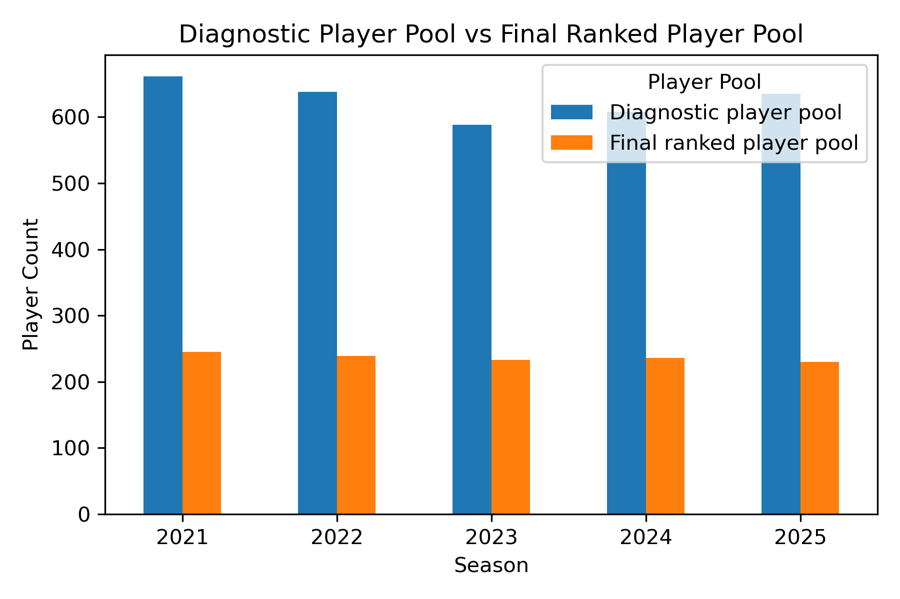
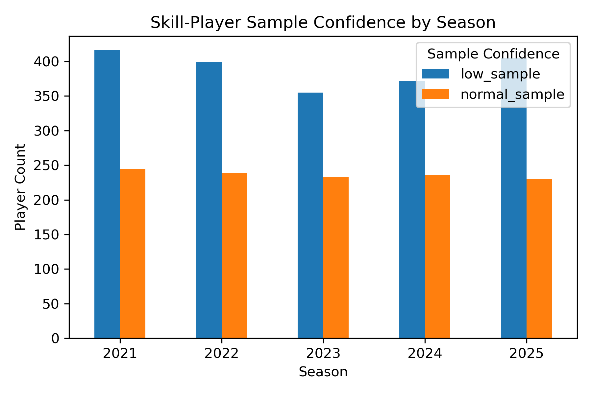

# NFL Moneyball: Finding Roster Surplus Value Under the Salary Cap

## Project Overview

This project builds a public-data NFL roster value model inspired by *Moneyball*. The goal is to identify which teams and players generate the most production relative to contract cost, then use the Philadelphia Eagles as a case study in sustainable roster construction.

The main idea is not simply to ask, “Who is good?” The project asks a more front-office-style question:

> Which teams and players create more value than their cost suggests?

The project evaluates all 32 NFL teams from 2021–2025, then focuses more closely on five teams:

- Philadelphia Eagles — main case study
- New York Giants — division/rebuild comparison
- Cleveland Browns — cap-efficiency comparison
- Baltimore Ravens — contender benchmark
- Detroit Lions — young-core benchmark

## Project Status

This is an ongoing portfolio project. The current version builds a team-level surplus value model, a skill-player value model, and an interactive Streamlit dashboard. Future iterations will expand the model to include defensive players, offensive linemen, injury adjustments, rookie-contract status, and draft capital analysis.

## Core Question

Can we identify roster-building inefficiencies using public NFL data?

More specifically:

- Which teams outperform their contract-cost profile?
- Which skill players generate the most surplus value?
- What player archetypes appear undervalued?
- How do the Eagles compare with the Giants, Browns, Ravens, and Lions?
- Can public data reveal a repeatable roster-building edge?

## Moneyball Thesis

The “Moneyball” idea in this project is that NFL teams should not only chase raw talent or name recognition. They should look for production before it becomes expensive.

In baseball, the Oakland A’s found value in traits the market underpriced. In this NFL version, the potential inefficiency is:

> The market pays heavily for already-proven production, but surplus value comes from identifying production one contract cycle earlier.

For the Eagles, the early finding is:

> The Eagles’ roster-building edge is not that every star is cheap. It is that they combine expensive stars with enough surplus-value contributors to keep the overall roster efficient.

## Dashboard Preview
Live dashboard: [View the Streamlit app](https://nfl-moneyball-roster-value.streamlit.app/)

This project includes a Streamlit dashboard for exploring team-level and player-level surplus value.

To run it locally:

```bash
streamlit run app.py
```
Example dashboard views:








## Data Sources

This project uses public NFL data through `nflreadpy`, including:

- play-by-play data
- player statistics
- team statistics
- roster data
- contract data
- draft data
- snap count data for future expansion

The project uses data from the 2021, 2022, 2023, 2024, and 2025 seasons.

## Why 2021–2025?

The model uses a five-season window to balance sample size and relevance.

A one-season sample can be too noisy because injuries, schedule strength, and small-sample performance can distort results. A much longer window can become less relevant because NFL rosters turn over quickly, coaching staffs change, and rookie contracts expire.

A 2021–2025 window gives enough data to observe roster-building trends while staying close to the current NFL environment.

## Methodology

### Team Performance

Team performance is measured using offensive and defensive EPA per play.

For each team-season, the model calculates:

- offensive EPA per play
- offensive success rate
- defensive EPA allowed per play
- offense rank
- defense rank
- overall performance rank

Lower overall rank means better performance.

### Contract Cost

Contract cost is measured using a cleaned public contract-cost proxy built from yearly contract data.

The raw contract data includes nested year-by-year contract rows, so the project flattens the contract data into one row per player-contract-season. The model then removes duplicate player-team-season rows before aggregating team cost.

The main cost fields are:

- cap number
- cash paid
- base salary
- guaranteed salary

Because this is public contract data, the model treats cost as a proxy rather than audited official salary-cap accounting.

In dashboard tables, contract cost fields such as `cap_number` are displayed in millions of dollars based on the cleaned public contract data.

### Team Surplus Value

Team surplus value compares how well a team performed against how expensive its roster was.

```text
surplus_rank_gap = cap_cost_rank - overall_performance_rank
```

A positive surplus rank gap means a team performed better than its cost rank.

For example:

```text
cap_cost_rank = 25
overall_performance_rank = 5
surplus_rank_gap = 20
```

This would indicate strong surplus value because the team performed like a top-five team while ranking much lower in contract cost.

A negative surplus rank gap means a team was expensive relative to its performance.

### Player Surplus Value

The player-level model focuses on offensive skill players:

- QB
- RB
- WR
- TE

For each player-season, the model calculates a public-data production score using:

- passing EPA
- rushing EPA
- receiving EPA
- passing yards
- passing touchdowns
- interceptions
- sacks suffered
- rushing yards
- rushing touchdowns
- receptions
- receiving yards
- receiving touchdowns

Players are ranked within their position group by production and by contract cost.

```text
player_surplus_gap = cost_rank_position - production_rank_position
```

A positive player surplus gap means the player produced better than his cost rank.

A negative player surplus gap means the player was expensive relative to his production rank.

The player model is built at the player-team-season level. If a player appears for multiple teams in one season, each team stint may appear separately. This is useful for team roster analysis because it attributes production and contract cost to the team context in the public data, but it does not yet aggregate multi-team players into one full-season player valuation.

## Key Outputs

The project creates both team-level and player-level outputs.

### Team-Level Outputs

- `team_value_2021_2025.csv`
- `team_cost_2021_2025.csv`
- `team_surplus_2021_2025.csv`
- `focus_team_surplus_2021_2025.csv`

### Player-Level Outputs

- `player_value_skill_2021_2025.csv`
- `focus_player_value_skill_2021_2025.csv`
- `2025_eagles_skill_player_value.csv`
- `2025_top_skill_player_bargains.csv`

### Summary Outputs

- `focus_team_summary_2021_2025.csv`
- `team_surplus_summary_2025.csv`
- `eagles_skill_player_summary_2025.csv`
- `top_skill_player_bargains_2025.csv`
- `position_surplus_summary_2021_2025.csv`
- `cost_tier_surplus_summary_2021_2025.csv`

### Updated V2 Outputs

The v2 confidence workflow saves improved player-value files in `outputs_v2/`:

- `player_value_2021_2025_v2_confidence.csv`
- `focus_player_value_2021_2025_v2_confidence.csv`
- `player_value_diagnostics_2021_2025_v2_confidence.csv`

Summary outputs are saved in `outputs_v2/summary/`, including:

- `eagles_skill_player_summary_2025.csv`
- `top_skill_player_bargains_2025.csv`
- `player_data_quality_summary_2021_2025.csv`
- `player_data_quality_diagnostics_2021_2025.csv`

## Visualizations

The project creates several charts, including:

- 2025 contract cost proxy vs performance
- roster surplus value over time for focus teams
- average roster surplus value by focus team
- Eagles skill player surplus value
- Eagles skill player cost vs production
- top skill player bargains across the league

These visuals are saved in:

```text
outputs/figures/
```

## Early Findings

### 1. The Eagles stand out as a team-level surplus-value case

From 2021–2025, the Eagles show strong average roster surplus value among the focus teams. The model suggests that Philadelphia performed well relative to its public contract-cost profile.

This supports using the Eagles as the main case study.

### 2. The Eagles’ edge is portfolio construction, not just cheap stars

The player-level model shows that not every Eagles star grades as a surplus bargain. Expensive stars can still be excellent players while grading lower in surplus-value terms because they cost more.

This is important. The takeaway is not:

> The Eagles only win because their stars are cheap.

The better takeaway is:

> The Eagles can afford expensive stars because they generate enough surplus value elsewhere.

### 3. DeVonta Smith, Dallas Goedert, and Jalen Hurts grade positively in the 2025 skill-player model

In the 2025 Eagles skill-player model, DeVonta Smith, Dallas Goedert, and Jalen Hurts show positive surplus value.

This suggests that some of Philadelphia’s offensive value comes from players whose production rank compares favorably with their cost rank.

### 4. Expensive players are not automatically bad values, but the bar is higher

Players like A.J. Brown and Saquon Barkley can be excellent football players while still grading lower in a surplus-value model. The reason is simple: when a player is expensive, he must produce at an elite level to outperform his cost rank.

This distinction is important for interpreting the model.

### 5. The Giants are a useful contrast case

The Giants serve as a useful comparison because the model separates cheap production from overall team quality. A team can have some individual player bargains while still performing poorly overall.

This reinforces why both team-level and player-level analysis are needed.

### 6. Low-cost skill players are the clearest surplus-value archetype

The market inefficiency analysis shows a consistent pattern across offensive skill positions: low-cost players generate positive average surplus value, while mid/high/premium-cost players often generate negative surplus value relative to their cost rank.

The clearest example is wide receiver. From 2021–2025, low-cost wide receivers produced an average surplus gap of +12.2, while high-cost and premium-cost wide receivers produced negative average surplus gaps.

This does not mean expensive wide receivers are bad players. It means the cost hurdle is much higher. Once a player is paid like a proven star, he has to produce at an elite level just to remain a surplus-value asset.

The broader Moneyball takeaway is:

> The market pays heavily for proven production. The edge comes from identifying production before it becomes expensive.

## Eagles Case Study: Surplus Value Across the Contract Cycle

The Eagles case study shows how surplus value changes as players move through the contract cycle.

At quarterback, Philadelphia’s surplus value was highest when Jalen Hurts was inexpensive. The Eagles’ QB surplus gap was +33.0 in 2022, then narrowed to +3.0 in 2025 as the average cap number for the position increased.

This does not mean Hurts stopped being valuable. It means the cost hurdle became much higher once his contract reflected his proven production.

A similar pattern appears at wide receiver. The Eagles’ WR group produced strong average surplus value in 2022 and 2023, then remained positive but less extreme as the average cap number increased.

This supports the project’s central thesis:

> Surplus value is largest before the market fully prices the production.

The Eagles’ challenge going forward is not simply finding stars. It is continuously replacing lost surplus value as previously underpriced players become expensive.


## V2 Update: Data Quality and Confidence Flags

The second version of the player-value model adds data-quality and confidence flags to make the results more defensible.

In the original version, missing public contract data could distort player rankings because missing cost information risked being treated like a true zero-dollar cost. In the updated version, missing contract values are kept as missing, and players are flagged based on whether they successfully matched to a public contract row.

The updated player model now includes:

- `has_contract_match`: whether the player matched to a contract record
- `has_missing_contract`: whether the player is missing public contract data
- `contract_confidence`: readable label for contract match quality
- `meets_sample_threshold`: whether the player had enough usage to be ranked
- `sample_confidence`: readable label for sample-size quality
- `overall_confidence`: overall confidence label based on contract and sample-size flags

Low-sample players are preserved in a diagnostic output file but excluded from the final ranked player-value table. This keeps the final rankings focused on players with meaningful usage while still making it possible to audit which players were excluded and why.

The updated workflow creates two types of player outputs:

1. Final ranked player-value outputs for qualifying QB/RB/WR/TE players.
2. Diagnostic outputs that include all skill-position players before the sample-size filter.

This improves interpretation because a player is no longer simply labeled as a bargain or overpay. The model can now distinguish between high-confidence results and results that may be affected by missing contract data or small samples.

For example, a player with a positive surplus gap and high confidence can be interpreted as a stronger bargain candidate than a player with a similar gap but missing contract data.

This update does not fully solve all limitations. The model still uses public contract data as a proxy, focuses only on QB/RB/WR/TE, and uses hand-built production-score weights. However, the confidence flags make those limitations more visible and prevent missing data from being treated as meaningful cost information.


## Project Files

```text
performance.py
cost.py
surplus_value.py
visuals.py
player_data_audit.py
player_value.py
player_value_v2_confidence.py
player_visuals.py
insight_summary.py
insight_summary_v2_confidence.py
visuals_v2_confidence.py
market_inefficiency.py
app.py
```

## File Descriptions

### `performance.py`

Builds the team performance table using play-by-play data.

Main outputs:

- offensive EPA per play
- defensive EPA allowed per play
- offense rank
- defense rank
- overall rank

### `cost.py`

Builds the team cost table using public contract data.

Main steps:

- loads contract data
- flattens nested yearly contract data
- maps team names to abbreviations
- removes duplicate player-team-season rows
- aggregates contract cost by team-season

### `surplus_value.py`

Merges team performance and team cost.

Main outputs:

- surplus rank gap
- surplus value rank
- surplus value tier

### `visuals.py`

Creates team-level charts.

### `player_data_audit.py`

Audits the player-level datasets before modeling.

This file checks:

- dataframe shapes
- column names
- join keys
- contract match rates
- duplicate contract rows

### `player_value.py`

Builds the player-level skill-position surplus value model.

The first version focuses on:

- QB
- RB
- WR
- TE

### `player_value_v2_confidence.py`

Builds the updated player-level skill-position surplus value model with confidence and data-quality flags.

This version preserves missing contract values as missing, flags contract match quality, identifies low-sample players, saves a diagnostic file before filtering, and creates final ranked player-value outputs for qualifying QB/RB/WR/TE players.

### `player_visuals.py`

Creates player-level charts, including Eagles-specific player value charts.

### `insight_summary.py`

Creates clean summary tables for the final writeup and dashboard.

### `insight_summary_v2_confidence.py`

Creates updated summary tables using the v2 confidence player-value outputs.

This file carries confidence labels into the Eagles player summary, top league-wide bargain summary, and data-quality summary files.

### `visuals_v2_confidence.py`

Creates v2 confidence visuals showing sample-confidence, contract-confidence, overall-confidence, and diagnostic-vs-ranked player pool counts by season.

### `market_inefficiency.py`

Summarizes player surplus value by position and cost tier to identify potential market inefficiencies.

### `app.py`

Optional Streamlit dashboard for exploring the results interactively.

## How to Run the Project

### Original Workflow

```text
performance.py
cost.py
surplus_value.py
visuals.py
player_data_audit.py
player_value.py
player_visuals.py
insight_summary.py
market_inefficiency.py
```

Optional dashboard:

```bash
streamlit run app.py
```
Note: the Streamlit dashboard now uses the v2 confidence player outputs for the player-level sections, while team-level views still use the original team surplus outputs.

### V2 Confidence Workflow

The v2 confidence workflow uses the existing team and contract outputs, then creates updated player-value and summary files with confidence flags.

```text
performance.py
cost.py
surplus_value.py
player_value_v2_confidence.py
insight_summary_v2_confidence.py
visuals_v2_confidence.py
```
The v2 workflow saves updated player-value files in `outputs_v2/`, updated summary files in `outputs_v2/summary/`, and diagnostic visuals in `outputs_v2/figures/`.

### V2 Confidence Visuals

The v2 workflow also creates diagnostic visuals in `outputs_v2/figures/`.





These charts show why the final ranked player-value table is smaller than the diagnostic player pool: many skill-position players appear in the raw data but do not meet the usage threshold for meaningful ranking.

## Limitations

This model is a public-data approximation and should be interpreted as a decision-support tool, not a perfect front-office valuation system.

Key limitations:

- Public contract data is an approximation, not official audited salary-cap accounting.
- Missing contract data can reduce confidence in some player rankings.
- The player model currently covers only QB, RB, WR, and TE.
- Defensive players and offensive linemen are not yet modeled.
- Production-score weights are hand-built rather than statistically learned.
- Rank gaps are intuitive but coarse and do not show the magnitude between players.
- The model does not yet adjust for injuries, rookie-contract status, draft capital, scheme, teammates, coaching context, or strength of schedule.
- Player value is ranked within position groups, so comparisons across positions should be made carefully.

## Future Improvements

Future versions of this project could add:

- defensive player surplus value
- offensive line value proxies
- rookie-contract status
- draft capital analysis
- injury-adjusted value
- age curves by position
- free-agent target recommendations
- trade-down scenario modeling
- a more polished Streamlit dashboard
- comparison between surplus value and playoff success

## Final Takeaway

The project’s core finding is that NFL roster efficiency is not about being cheap. It is about knowing when to pay for premium talent and when to search for underpriced production.

The strongest market-efficiency pattern in the model is that low-cost offensive skill players, especially wide receivers, running backs, and tight ends, generate positive surplus value on average, while mid/high/premium-cost players face a much steeper value hurdle.

For the Eagles, the early evidence suggests:

> Philadelphia’s advantage comes from portfolio construction: combining premium stars with enough low-cost surplus contributors to keep the full roster efficient.

The Billy Beane-style insight is not “avoid expensive players.” It is:

> Find production before the market prices it as proven production.

The v2 confidence update makes this conclusion more defensible by separating high-confidence player rankings from results that may be affected by missing public contract data or small samples.

It is also an important step toward turning the project from a descriptive ranking model into a decision-support tool, because it separates stronger signals from results that may be distorted by missing contract data or small samples.

In NFL roster-building terms, the edge comes from identifying value one contract cycle early while being honest about the limits of the available public data.